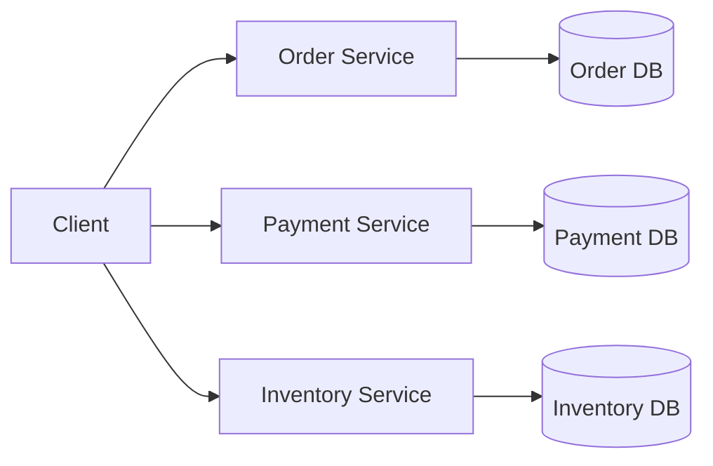

# Database per service pattern
- https://youtube.com/watch?v=DKQLhy9bgdk

## Overview



## Benefits
```
Loose coupling
Independent deployment
Independent scaling
Each service can choose the best DB technology
Failure/data changes are isolated
```
## Challenges

| Challenge           | Why                                        |
| ------------------- | ------------------------------------------ |
| **Cross-service joins** | Data exists in different DBs               |
| Transactions        | No simple ACID transaction across services |
| **Consistency**         | Usually requires eventual consistency      |
| Reporting           | Aggregating data becomes harder            |

## Solutions
- Saga Pattern
- Event-driven communication
- CQRS
- Event Sourcing
- API Aggregation [aggregator.md](04_core_pattern_03_aggregator.md)