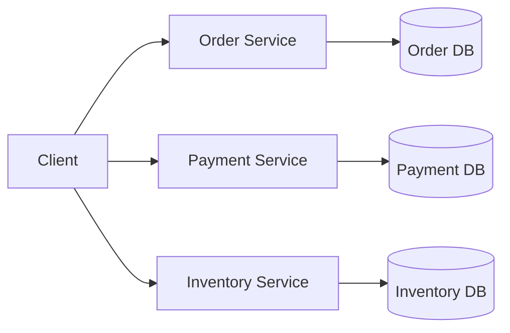

# Database per service pattern
- https://youtube.com/watch?v=DKQLhy9bgdk

## Overview



- **Implementation Approaches**
    - Private table/s per service
    - Schema per service
    - Database server per service
  
- solution:
    - data will propagate from service to service via event data. 👈🏻


## Benefits
```
Loose coupling
Independent deployment
Independent scaling
Each service can choose the best DB technology
Failure/data changes are isolated
```
## Challenges

| Challenge           | Why                                        |
| ------------------- | ------------------------------------------ |
| **Cross-service joins** | Data exists in different DBs               |
| Distributed transactions        | No simple ACID transaction across services |
| **Consistency**         | Usually requires eventual consistency      |
| Reporting           | Aggregating data becomes harder            |
|Data duplication||

## Solutions
- Saga Pattern  [distributed-Transaction.md](../SD_06_Distributed-system/02_03_distributed-Transaction.md#saga-choreography)
- Event-driven communication [asynchronous.md](../SD_03_Core-building-blocks/SD_03_54_IPC/02_asynchronous.md#2-event-driven)
- CQRS and Event Sourcing
- API Aggregation [aggregator.md](04_core_pattern_03_aggregator.md)