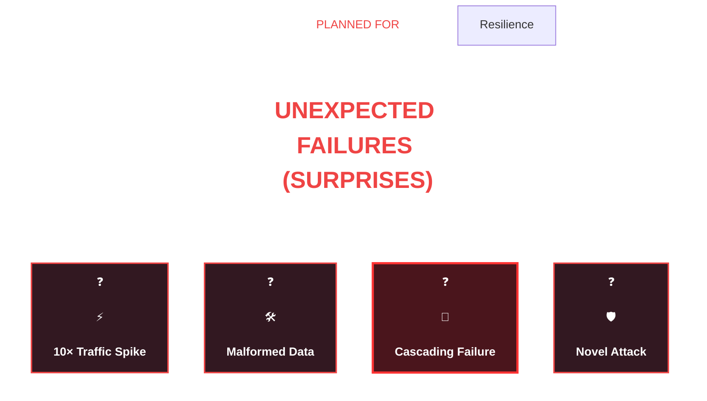

# Resilient System
## Overview


---
## Strategies/patterns (for microservice)
### 1 Decouple system with message broker

### 2 Circuit Breaker pattern
```text
Purpose: 
Prevent cascading failures in distributed systems.

Implementation:
Use libraries like Resilience4j or Hystrix.
Define thresholds (e.g., failure rate, timeout) to trip the circuit.
Implement fallback mechanisms (e.g., cached responses, default values).

Use Case: 
Microservices calling external APIs (e.g., payment gateways, third-party services).
```
### 3 Timeout + retries

### 4 rate limiting

### 5 bulk head


