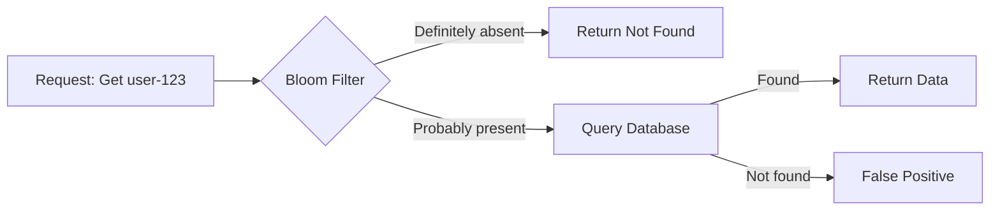
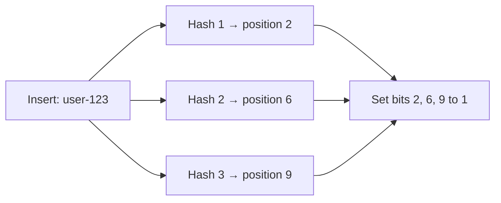

# Bloom Filter
## Overview
> think of java hashmap [k,V] with value as 0 ot 1.
> - Index:  0 1 2 3 4 5 6 7 8 9
> - Bits:   0 0 1 0 0 0 1 0 0 1



- https://www.youtube.com/watch?v=GT0En1dGntY
- memory-efficient probabilistic data structure used to check whether an item might exist in a set.
- **probabilistic data structure** that tells you:
    - ❌ Definitely not present
    - ✅ Probably present  === false positive
    - It does not store the actual data.
- TradeOff `accuracy` for `speed + memory` 👈🏻
  - Extremely memory efficient, since using bit array
  - Great for high-throughput systems
  - prevent unnecessary disk lookup, by acting first line of defence

---
## Operations (2)
### Insert

### lookup
calculate the same hash positions.

| Bit check result        | Bloom filter response  |
| ----------------------- | ---------------------- |
| At least one bit is `0` | Definitely not present |
| All bits are `1`        | Probably present       |

**False Positive** occurs when the Bloom filter says:
- The item may exist
- But the item does not actually exist.
- This happens because different items can set the same bit positions.


**False Negative**
- if filter says the item does not exist, but it actually exists.
- IMPOSSIBLE :)
- Bloom filter never show false negative


---
## Optimization
```
m = number of bits in the Bloom filter array
n = number of inserted elements
k (optimul number of hash functions) = m/n (ln2)  | ln2 ≈ 0.693
---
m = 10,000 bits
n = 1,000 elements
k = (10,000 / 1,000) × 0.693
k = 6.93 ≈ 7 hash functions
```

---
## Real-world applications 
- Cassandra and HBase SSTable lookups
- Database cache protection
- Web crawler URL deduplication
- Username availability checks 👈
- CDN and storage existence checks