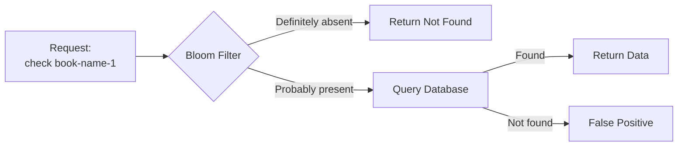
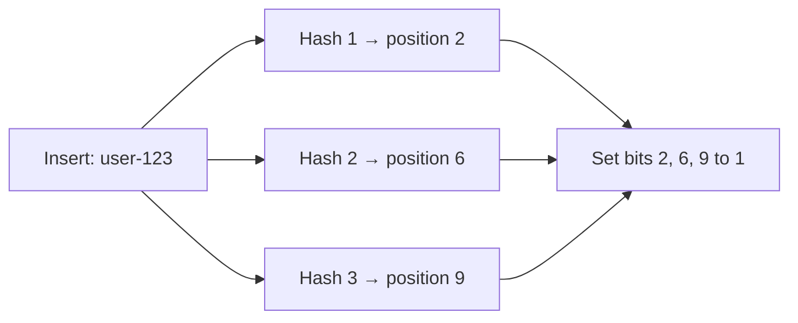
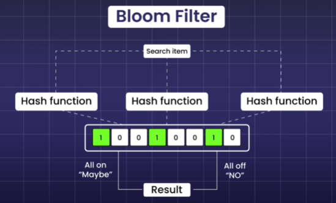
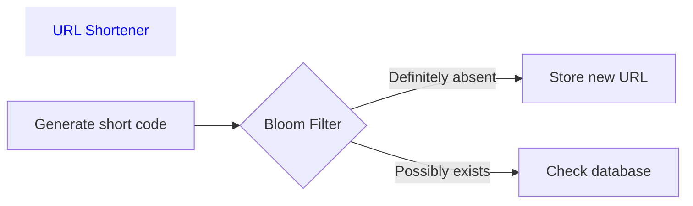
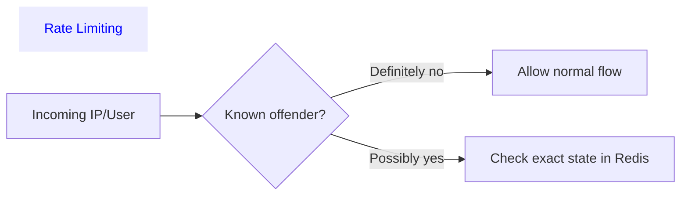
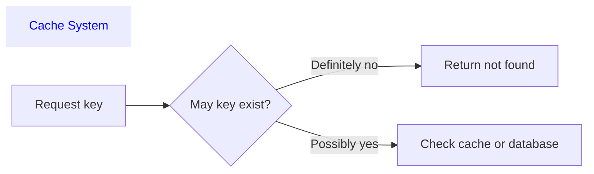
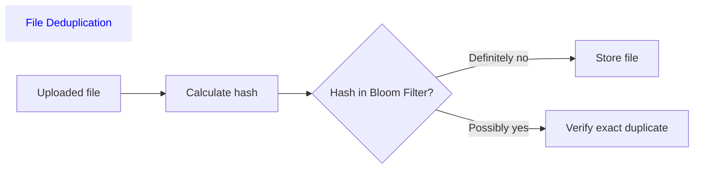

# Bloom Filter
- https://academy.bytemonk.io/products/system-design-mastery-beta/categories/2158360644/posts/2192332142
- https://www.youtube.com/watch?v=GT0En1dGntY
- [05_concept_01_hashing.md](../SD_01_foundation/05_concept_01_hashing.md)
---

## Overview
**Memory-efficient + probabilistic** data structure used to check whether an item might exist in a set.
> hashmap [k,V]
> - Index (key):  0 1 2 3 4 5 6 7 8 9
> - Bits (values):   0 0 1 0 0 0 1 0 0 1




## TradeOff 
- **Accuracy**  vs **(speed + memory)**
  - Extremely memory efficient, since using bit array
  - Great for high-throughput systems
  - prevent unnecessary disk lookup, by acting first line of defence

---
## Operations (2)
### 1. Insert

### 2. lookup
calculate the same hash positions.

| Bit check result        | Bloom filter response  |
| ----------------------- | ---------------------- |
| At least one bit is `0` | Definitely not present |
| All bits are `1`        | Probably present       |

**False Positive** occurs when the Bloom filter says:
- The item may exist
- But the item does not actually exist.
- This happens because different items can set the same bit positions.


**False Negative**
- if filter says the item does not exist, but it actually exists.
- IMPOSSIBLE :)
- Bloom filter never show false negative



---
## Optimization:
```
m = number of bits in the Bloom filter array
n = number of inserted elements
k (optimal number of hash functions) = m/n (ln2)  | ln2 ≈ 0.693
---
m = 10,000 bits, n = 1,000 elements
k = (10,000 / 1,000) × 0.693  --> 7 hash functions
```
| Optimization                           | Why it matters                                      |
| -------------------------------------- | --------------------------------------------------- |
| Choose the right bit-array size `m`    | Larger `m` reduces false positives                  |
| Choose the optimal hash count `k`      | Too few or too many hashes increase false positives |
| Estimate inserted items `n` correctly  | Underestimating `n` causes filter saturation        |
| Use fast independent hashes            | Reduces CPU cost and improves distribution          |
| Monitor fill ratio                     | A heavily filled filter becomes ineffective         |
| Rebuild when capacity is exceeded      | Bloom filters do not resize cleanly                 |
| Use partitioned/scalable Bloom filters | Better when data volume grows unpredictably         |
- can use multiple filter, ask same thing to multiple filter.
---
## Interview Scenarios
| Scenario               | What Bloom Filter checks                   | Benefit                                        | Important limitation                                  |
| ---------------------- | ------------------------------------------ | ---------------------------------------------- | ----------------------------------------------------- |
| **URL Shortener**      | Whether a short code may already exist     | Avoids unnecessary database lookups            | A positive result still needs DB verification         |
| **Rate Limiting**      | Whether an IP/user may be a known offender | Fast first-pass filtering before Redis or DB   | Cannot reliably store exact request counts            |
| **Cache System**       | Whether a requested key may exist          | Prevents cache penetration and repeated misses | False positives may still reach the database          |
| **File Deduplication** | Whether a file hash may already exist      | Quickly filters likely duplicate uploads       | Confirm duplicates using full hash or byte comparison |







---
## Real-world examples 
- Cassandra and HBase SSTable lookups
- Database cache protection
- Web crawler URL deduplication
- Username availability checks 👈
- CDN and storage existence checks