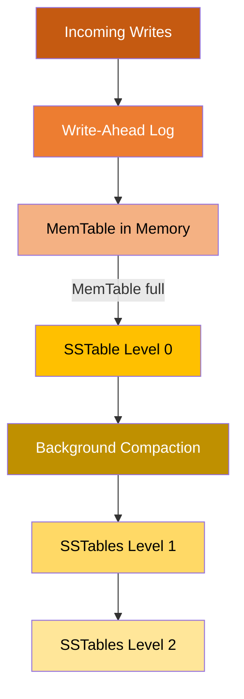

# LSM
## Overview

---
## Write behavior (fast)
> Write → WAL → MemTable → SSTable → Compaction

Writes are fast because:
- Data is **first written to memory**
- Disk writes are mostly **sequential**
- Multiple writes are **flushed together**
- Existing disk files are not immediately updated

---
## Read behavior (Slow)
- MemTable → Level 0 SSTables → Level 1 → Level 2
- Hence LSM systems normally use with [BloomFilter](01_BloomFilter.md)

---
## Common systems
`Cassandra`,`RocksDB`,`LevelDB`,`HBase`,`ScyllaDB`

---
## comparison
| Area                | B-Tree / B+ Tree              | LSM Tree                            |
| ------------------- | ----------------------------- | ----------------------------------- |
| Write method        | Update pages in place         | Append and flush sequentially       |
| Read speed          | Usually faster                | May check multiple files            |
| Write throughput    | Moderate                      | Usually higher                      |
| Range queries       | Excellent                     | Good, but depends on compaction     |
| Background work     | Page maintenance              | Compaction                          |
| Read amplification  | Low                           | Can be higher                       |
| Write amplification | Page splits and index updates | Compaction rewrites data            |
| Best workload       | Read-heavy or balanced        | Write-heavy                         |

