# SE 02 — System Design Navigation

## Overview

This structure organizes the system-design notes into a consistent learning path.

```text
SE_02_system-design/
├── README.md
├── artifact.md
├── SD_01_foundations/
├── SD_02_non-functional-requirements/
├── SD_03_architecture-and-building-blocks/
├── SD_04_resilience-and-server-protection/
├── SD_05_data-and-storage/
├── SD_06_messaging-and-event-driven-systems/
├── SD_07_distributed-algorithms/
├── SD_08_api-design/
├── SD_09_security/
├── SD_10_observability/
├── SD_11_deployment-and-platform/
└── SD_12_case-studies/
```

---
# SD 01 — Foundations
1. [System Design Overview](SD_01_foundations/01-system-design-overview.md)
2. [System Evolution](SD_01_foundations/02-system-evolution.md)
3. [Client-Server Request Flow](SD_01_foundations/03-client-server-request-flow.md)
4. [Distributed Systems](SD_01_foundations/04-distributed-systems.md)
5. [CAP Theorem](SD_01_foundations/05-cap-theorem.md)
6. [Process, Thread, and Kernel](SD_01_foundations/06-process-thread-and-kernel.md)
7. [Sockets](SD_01_foundations/07-sockets.md)
8. [Event Loop](SD_01_foundations/08-event-loop.md)
9. [Heartbeats and Health Checks](SD_01_foundations/09-heartbeats-and-health-checks.md)
10. [Idempotency](SD_01_foundations/10-idempotency.md)
11. [Hashing](SD_01_foundations/11-hashing.md)

---
# SD 02 — Non-Functional Requirements
1. [NFR Overview](SD_02_non-functional-requirements/01-nfr-overview.md)
2. [Availability](SD_02_non-functional-requirements/02-availability.md)
3. [Reliability](SD_02_non-functional-requirements/03-reliability.md)
4. [Latency](SD_02_non-functional-requirements/04-latency.md)
5. [Throughput](SD_02_non-functional-requirements/05-throughput.md)
6. [Scalability](SD_02_non-functional-requirements/06-scalability.md)
7. [Consistency](SD_02_non-functional-requirements/07-consistency.md)
8. [Durability](SD_02_non-functional-requirements/08-durability.md)
9. [Read-Write Ratio](SD_02_non-functional-requirements/09-read-write-ratio.md)
10. [Fault Tolerance](SD_02_non-functional-requirements/10-fault-tolerance.md)
11. [Resilience](SD_02_non-functional-requirements/11-resilience.md)
12. [Maintainability and Cost](SD_02_non-functional-requirements/12-maintainability-and-cost.md)
13. [Trade-Offs](SD_02_non-functional-requirements/13-trade-offs.md)
14. [Reliability vs Availability vs Resilience](SD_02_non-functional-requirements/14-reliability-vs-availability-vs-resilience.md)

---
# SD 03 — Architecture and Building Blocks
## 03.1 Architecture
1. [Client-Server Architecture](SD_03_architecture-and-building-blocks/01_architecture/01-client-server.md)
2. [Monolithic Architecture](SD_03_architecture-and-building-blocks/01_architecture/02-monolith.md)
3. [Microservices Architecture](SD_03_architecture-and-building-blocks/01_architecture/03-microservices.md)
4. [Event-Driven Architecture](SD_03_architecture-and-building-blocks/01_architecture/04-event-driven.md)
5. [Stateless Architecture](SD_03_architecture-and-building-blocks/01_architecture/05-stateless-architecture.md)
6. [Service Mesh](SD_03_architecture-and-building-blocks/01_architecture/06-service-mesh.md)

## 03.2 Traffic and Delivery
1. [Load Balancer](SD_03_architecture-and-building-blocks/02_traffic-and-delivery/01-load-balancer.md)
2. [Content Delivery Network](SD_03_architecture-and-building-blocks/02_traffic-and-delivery/02-cdn.md)
3. [Forward and Reverse Proxy](SD_03_architecture-and-building-blocks/02_traffic-and-delivery/03-forward-and-reverse-proxy.md)
4. [Pre-Signed URLs](SD_03_architecture-and-building-blocks/02_traffic-and-delivery/04-pre-signed-urls.md)
5. [Scale Cube](SD_03_architecture-and-building-blocks/02_traffic-and-delivery/05-scale-cube.md)

## 03.3 Data Structures
1. [Bloom Filter](SD_03_architecture-and-building-blocks/03_data-structures/01-bloom-filter.md)
2. [B-Tree and B+ Tree](SD_03_architecture-and-building-blocks/03_data-structures/02-b-tree-and-b-plus-tree.md)
3. [LSM Tree](SD_03_architecture-and-building-blocks/03_data-structures/03-lsm-tree.md)
4. [B-Tree vs LSM Tree](SD_03_architecture-and-building-blocks/03_data-structures/04-b-tree-vs-lsm-tree.md)
5. [Database Indexes](SD_03_architecture-and-building-blocks/03_data-structures/05-database-indexes.md)

---
# SD 04 — Resilience and Server Protection
1. [Overload and Death Spiral](SD_04_resilience-and-server-protection/01-overload-and-death-spiral.md)
2. [Auto Scaling](SD_04_resilience-and-server-protection/02-auto-scaling.md)
3. [Load Shedding](SD_04_resilience-and-server-protection/03-load-shedding.md)
4. [Rate Limiting](SD_04_resilience-and-server-protection/04-rate-limiting.md)
5. [Backpressure](SD_04_resilience-and-server-protection/05-backpressure.md)
6. [Circuit Breaker](SD_04_resilience-and-server-protection/06-circuit-breaker.md)
7. [Timeouts](SD_04_resilience-and-server-protection/07-timeouts.md)
8. [Retries and Exponential Backoff](SD_04_resilience-and-server-protection/08-retries-and-backoff.md)
9. [Bulkhead Pattern](SD_04_resilience-and-server-protection/09-bulkhead-pattern.md)
10. [Graceful Degradation](SD_04_resilience-and-server-protection/10-graceful-degradation.md)
11. [Noisy Neighbor](SD_04_resilience-and-server-protection/11-noisy-neighbor.md)
12. [Admission Control](SD_04_resilience-and-server-protection/12-admission-control.md)

---
# SD 05 — Data and Storage
## 05.1 Fundamentals
1. [Memory](SD_05_data-and-storage/01_fundamentals/01-memory.md)
2. [Storage](SD_05_data-and-storage/01_fundamentals/02-storage.md)
3. [Database Overview](SD_05_data-and-storage/01_fundamentals/03-database-overview.md)
4. [SQL vs NoSQL](SD_05_data-and-storage/01_fundamentals/04-sql-vs-nosql.md)

## 05.2 Distributed Data
1. [Distributed Caching](SD_05_data-and-storage/02_distributed-data/01-distributed-caching.md)
2. [Distributed Locking](SD_05_data-and-storage/02_distributed-data/02-distributed-locking.md)
3. [Distributed Transactions](SD_05_data-and-storage/02_distributed-data/03-distributed-transactions.md)
4. [Distributed File Systems](SD_05_data-and-storage/02_distributed-data/04-distributed-file-systems.md)

## 05.3 Scaling Patterns
1. [Replication](SD_05_data-and-storage/03_scaling-patterns/01-replication.md)
2. [Partitioning](SD_05_data-and-storage/03_scaling-patterns/02-partitioning.md)
3. [Sharding](SD_05_data-and-storage/03_scaling-patterns/03-sharding.md)
4. [Consistent Hashing](SD_05_data-and-storage/03_scaling-patterns/04-consistent-hashing.md)

## 05.4 Databases
1. [Redis](SD_05_data-and-storage/04_databases/01-redis.md)
2. [B-Tree-Based Databases](SD_05_data-and-storage/04_databases/02-b-tree-databases.md)
3. [LSM-Tree-Based Databases](SD_05_data-and-storage/04_databases/03-lsm-tree-databases.md)

## 05.5 Transaction Patterns
1. [CQRS](SD_05_data-and-storage/05_transaction-patterns/01-cqrs.md)
2. [Saga Pattern](SD_05_data-and-storage/05_transaction-patterns/02-saga.md)

---
# SD 06 — Messaging and Event-Driven Systems
1. [Message Queue Basics](SD_06_messaging-and-event-driven-systems/01-message-queue-basics.md)
2. [Publish-Subscribe](SD_06_messaging-and-event-driven-systems/02-publish-subscribe.md)
3. [Kafka Basics](SD_06_messaging-and-event-driven-systems/03-kafka-basics.md)
4. [Partitions and Consumer Groups](SD_06_messaging-and-event-driven-systems/04-partitions-and-consumer-groups.md)
5. [Delivery Semantics](SD_06_messaging-and-event-driven-systems/05-delivery-semantics.md)
6. [Message Ordering](SD_06_messaging-and-event-driven-systems/06-message-ordering.md)
7. [Dead-Letter Queues](SD_06_messaging-and-event-driven-systems/07-dead-letter-queues.md)
8. [Transactional Outbox](SD_06_messaging-and-event-driven-systems/08-transactional-outbox.md)
9. [Event Sourcing](SD_06_messaging-and-event-driven-systems/09-event-sourcing.md)
10. [Messaging Backpressure](SD_06_messaging-and-event-driven-systems/10-messaging-backpressure.md)

---
# SD 07 — Distributed Algorithms and Advanced Concepts
1. [Leader Election](SD_07_distributed-algorithms/01-leader-election.md)
2. [Consensus](SD_07_distributed-algorithms/02-consensus.md)
3. [Quorum](SD_07_distributed-algorithms/03-quorum.md)
4. [Vector Clocks](SD_07_distributed-algorithms/04-vector-clocks.md)
5. [Logical Clocks](SD_07_distributed-algorithms/05-logical-clocks.md)
6. [Gossip Protocol](SD_07_distributed-algorithms/06-gossip-protocol.md)
7. [Erasure Coding](SD_07_distributed-algorithms/07-erasure-coding.md)
8. [HyperLogLog](SD_07_distributed-algorithms/08-hyperloglog.md)
9. [MapReduce](SD_07_distributed-algorithms/09-mapreduce.md)

---
# SD 08 — API Design
1. [Network Protocols](SD_08_api-design/01-network-protocols.md)
2. [REST API Design](SD_08_api-design/02-rest-api-design.md)
3. [HTTP Methods and Status Codes](SD_08_api-design/03-http-methods-and-status-codes.md)
4. [HTTP Headers](SD_08_api-design/04-http-headers.md)
5. [Pagination](SD_08_api-design/05-pagination.md)
6. [Filtering and Sorting](SD_08_api-design/06-filtering-and-sorting.md)
7. [API Versioning](SD_08_api-design/07-api-versioning.md)
8. [API Idempotency](SD_08_api-design/08-api-idempotency.md)
9. [API Caching](SD_08_api-design/09-api-caching.md)
10. [API Rate Limiting](SD_08_api-design/10-api-rate-limiting.md)
11. [API Security](SD_08_api-design/11-api-security.md)
12. [API Testing](SD_08_api-design/12-api-testing.md)
13. [API Gateway](SD_08_api-design/13-api-gateway.md)
14. [Backend for Frontend](SD_08_api-design/14-backend-for-frontend.md)
15. [Aggregator Pattern](SD_08_api-design/15-aggregator-pattern.md)
16. [WebSocket, SSE, and gRPC](SD_08_api-design/16-websocket-sse-and-grpc.md)

---

# SD 09 — Security
## 09.1 Identity and Access
1. [Identity and Access Management](SD_09_security/01_identity-and-access/01-iam.md)
2. [Zero Trust Security](SD_09_security/01_identity-and-access/02-zero-trust-security.md)
3. [LDAP](SD_09_security/01_identity-and-access/03-ldap.md)
4. [Okta](SD_09_security/01_identity-and-access/04-okta.md)

## 09.2 Authentication and Authorization
1. [OAuth 2.0](SD_09_security/02_authentication-and-authorization/01-oauth2.md)
2. [OpenID Connect](SD_09_security/02_authentication-and-authorization/02-oidc.md)
3. [SAML](SD_09_security/02_authentication-and-authorization/03-saml.md)
4. [JWT](SD_09_security/02_authentication-and-authorization/04-jwt.md)
5. [Passkeys](SD_09_security/02_authentication-and-authorization/05-passkeys.md)
6. [Spring Boot Security](SD_09_security/02_authentication-and-authorization/06-spring-boot-security.md)

## 09.3 Transport and Certificates
1. [HTTPS and TLS](SD_09_security/03_transport-and-certificates/01-https-and-tls.md)
2. [X.509 Certificates](SD_09_security/03_transport-and-certificates/02-x509-certificates.md)
3. [SSH and Bastion Hosts](SD_09_security/03_transport-and-certificates/03-ssh-and-bastion-hosts.md)

## 09.4 Application Security
1. [CORS](SD_09_security/04_application-security/01-cors.md)
2. [Cross-Site Scripting](SD_09_security/04_application-security/02-xss.md)
3. [Cross-Site Request Forgery](SD_09_security/04_application-security/03-csrf.md)
4. [SQL Injection](SD_09_security/04_application-security/04-sql-injection.md)
5. [Clickjacking](SD_09_security/04_application-security/05-clickjacking.md)

---
# SD 10 — Observability
1. [Observability Overview](SD_10_observability/01-observability-overview.md)
2. [Logging](SD_10_observability/02-logging.md)
3. [Metrics](SD_10_observability/03-metrics.md)
4. [Distributed Tracing](SD_10_observability/04-distributed-tracing.md)
5. [OpenTelemetry](SD_10_observability/05-opentelemetry.md)
6. [Alerting](SD_10_observability/06-alerting.md)
7. [SLI, SLO, and SLA](SD_10_observability/07-sli-slo-sla.md)
8. [Golden Signals](SD_10_observability/08-golden-signals.md)
9. [Dashboard Design](SD_10_observability/09-dashboard-design.md)
10. [Correlation IDs](SD_10_observability/10-correlation-ids.md)

---
# SD 11 — Deployment and Platform
1. [Deployment Strategies](SD_11_deployment-and-platform/01-deployment-strategies.md)
2. [Blue-Green Deployment](SD_11_deployment-and-platform/02-blue-green-deployment.md)
3. [Canary Deployment](SD_11_deployment-and-platform/03-canary-deployment.md)
4. [Rolling Deployment](SD_11_deployment-and-platform/04-rolling-deployment.md)
5. [Container Orchestration](SD_11_deployment-and-platform/05-container-orchestration.md)
6. [Service Discovery](SD_11_deployment-and-platform/06-service-discovery.md)
7. [Sidecar and Ambassador Patterns](SD_11_deployment-and-platform/07-sidecar-and-ambassador.md)
8. [Configuration Management](SD_11_deployment-and-platform/08-configuration-management.md)
9. [Feature Flags](SD_11_deployment-and-platform/09-feature-flags.md)

---
# SD 12 — Case Studies
1. [URL Shortener](SD_12_case-studies/01-url-shortener.md)
2. [Rate Limiter](SD_12_case-studies/02-rate-limiter.md)
3. [Notification System](SD_12_case-studies/03-notification-system.md)
4. [Chat System](SD_12_case-studies/04-chat-system.md)
5. [News Feed](SD_12_case-studies/05-news-feed.md)
6. [File Storage System](SD_12_case-studies/06-file-storage-system.md)
7. [Video Streaming System](SD_12_case-studies/07-video-streaming-system.md)
8. [Payment System](SD_12_case-studies/08-payment-system.md)
9. [Distributed Job Scheduler](SD_12_case-studies/09-distributed-job-scheduler.md)
10. [Metrics and Monitoring System](SD_12_case-studies/10-metrics-and-monitoring-system.md)

---
# Recommended Learning Order

```mermaid
flowchart LR
    F[Foundations] --> N[Non-Functional Requirements]
    N --> A[Architecture and Building Blocks]
    A --> R[Resilience and Protection]
    R --> D[Data and Storage]
    D --> M[Messaging and Events]
    M --> API[API Design]
    API --> S[Security]
    S --> O[Observability]
    O --> P[Deployment and Platform]
    P --> C[Case Studies]
```


---
# Migration Notes
- Merge duplicate API Gateway notes into one primary page.
- Keep server-side rate-limiting algorithms under resilience.
- Keep HTTP `429` handling and API contracts under API design.
- Move circuit breaker out of API design and into resilience.
- Move service discovery and container orchestration into deployment and platform.
- Move deployment strategies out of observability.
- Keep caching pages separate only when their scope differs:
  - application caching
  - distributed caching
  - HTTP and CDN caching
- Replace unclear abbreviations such as `SFP` with descriptive names.
- Correct filename spelling before adding new content.
