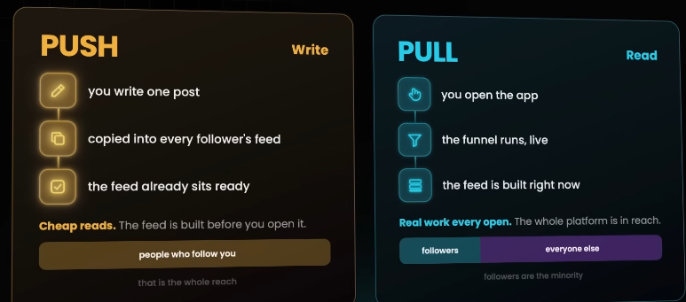
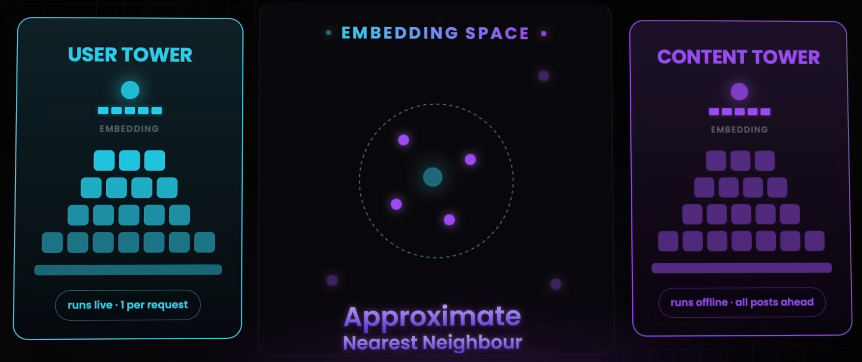
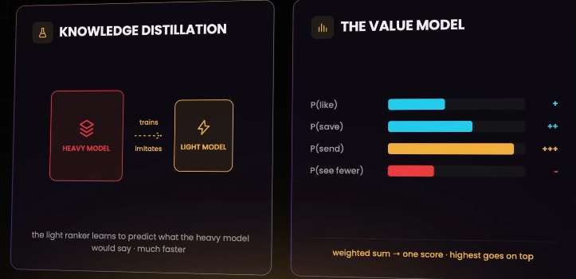

# Instagram (in 2026)
https://youtu.be/PGMZT6NQ-LQ?si=05HOE_q09r4wSccs

This video explores the technical evolution of *Instagram* from a chronological social network 
to a sophisticated **recommendation engine**, analyzing how a four-day-old account can reach 10 million users.

## 1. The Evolution of the Instagram Feed
**2010 (Chronological Feed):** Originally, the feed was a simple graph where users followed others.
- **Fan-out on write:** (Push Model)
  - When a user posted, the system copied the content to every follower's **pre-prepared feed**
  - This made reading fast but created the **Celebrity Problem**,
  - where accounts with millions of followers triggered massive write operations 
- **Celebrity Solution:** 
  - Large accounts are handled differently; 
  - their posts are fetched only when a follower opens the app

**2016 (Interest-Based Sorting):** 
- Instagram shifted to **sorting by predicted interest** 
- to prevent users from missing content (timing issue)
- though this was still confined to accounts a user followed

## 2. The Modern 
### Recommendation Funnel (Pull Model)

- To compete with platforms like *TikTok*, 
  - Instagram shifted to an **Interest Graph** 
  - that enables "unconnected reach" (content from strangers). 
- Because this cannot be pre-calculated, 
  - it uses a **pull model** (feed built when the app opens) 
  - via a **four-stage funnel** 

**Retrieval (Two-Tower Network):** 
- Uses a *Two-Tower model* to turn users and content into vectors (*user embeddings* and *content embeddings*). 
- It uses **Approximate Nearest Neighbor (ANN) search** 
  - to narrow billions of posts down to a few thousand relevant candidates

**Ranking:** 
- A lightweight model (via *knowledge distillation*) trims candidates to a few hundred,
- then a heavy **value model** predicts engagement (likes, saves, shares) to rank them 

**Re-ranking:** 
- The final stage ensures diversity and removes repetitive content

### Solving the Cold Start Problem**
For brand new accounts with no history, Instagram uses two strategies:

**Content Understanding:** 
- Directly analyzes the audio, images, and text of a post 
- to create embeddings without needing **historical engagement data**.

**Rate-Based Feedback Loop:** 
- The system tests a new post on a small group of non-followers. 
- It monitors the **rate of engagement** (likes/sends per view). 
- If this rate is high, the system automatically exposes the post to larger audiences, 
- creating a snowball effect

## Summary of Success
The viral success of a new account reaching 10 million followers in four days is attributed to the combination of : 
- **Interest Graph** (no follow edge required) 
- **Direct Content Classification**
- **Rate-Based Feedback Loop**