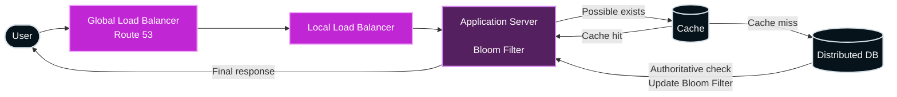

# How Big Tech Checks Your Username in Milliseconds
- https://www.youtube.com/watch?v=_l5Q5kKHtR8
- https://chatgpt.com/g/g-p-6a6ae32588fc819188496a122581a500/c/6a6adb28-e764-83e8-aa12-d516e7446173

| Technology             | Use in username prediction                               | Fit                          |
| ---------------------- | -------------------------------------------------------- | ---------------------------- |
| **Trie / Prefix Tree** | Find usernames starting with a prefix such as `lek`      | Excellent                    |
| **Redis HashMap**      | Exact username lookup, cache profile, availability check | Good                         |
| **B+ Tree**            | Prefix/range query using sorted usernames                | Good                         |
| **LSM Tree**           | Store large volumes of usernames with frequent writes    | Good for persistence         |
| **Bloom Filter**       | Quickly check whether a username is definitely absent    | Good optimization            |
| **Spanner DB**         | Distributed source of truth for usernames across regions | Possible, but often overkill |

---
## Options
### redis hashMap
- high speed ⭐

### Tries (Prefix tree)
- prediction matching ⭐

### B+ tree (Read optimized) 
- [03_algo_05_btree__.md](../../SE_02_system-design/SD_51_algo/03_algo_05_btree__.md)
- sorted lookup ⭐
- Commonly used in relational and NoSQL databases to **store sorted data**
- They allow for efficient range queries and `O(log n) ` lookups, even in massive datasets.

### Spanner DB
- Distributes B-tree like across on node/s
- hori scales
- support `millions-queries/sec`
- exact look up,  with no false positive

### LSM trees (Write optimized)
- [03_algo_06_LSM-tree__.md](../../SE_02_system-design/SD_51_algo/03_algo_06_LSM-tree__.md)

### Bloom filters
- false positive ⭐
- [03_algo_01_BloomFilter.md](../../SE_02_system-design/SD_53_DataStructure/01_core_01_BloomFilter.md)
